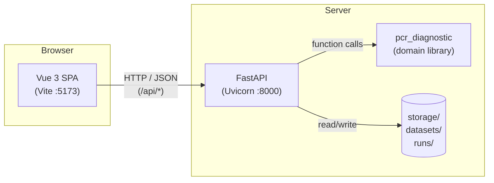
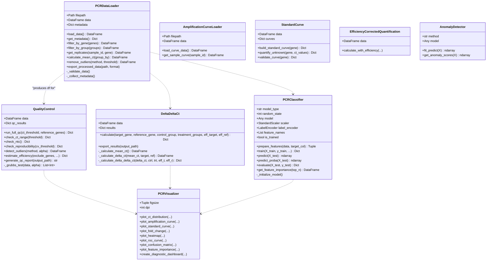
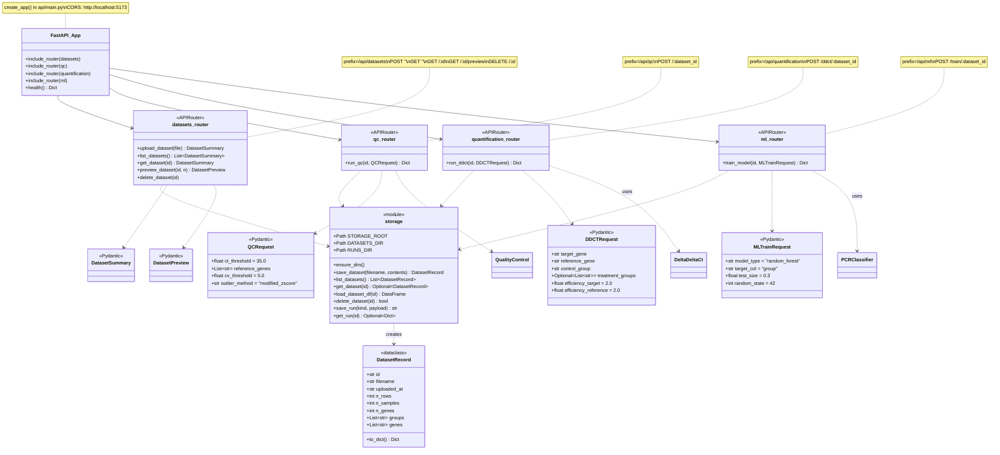
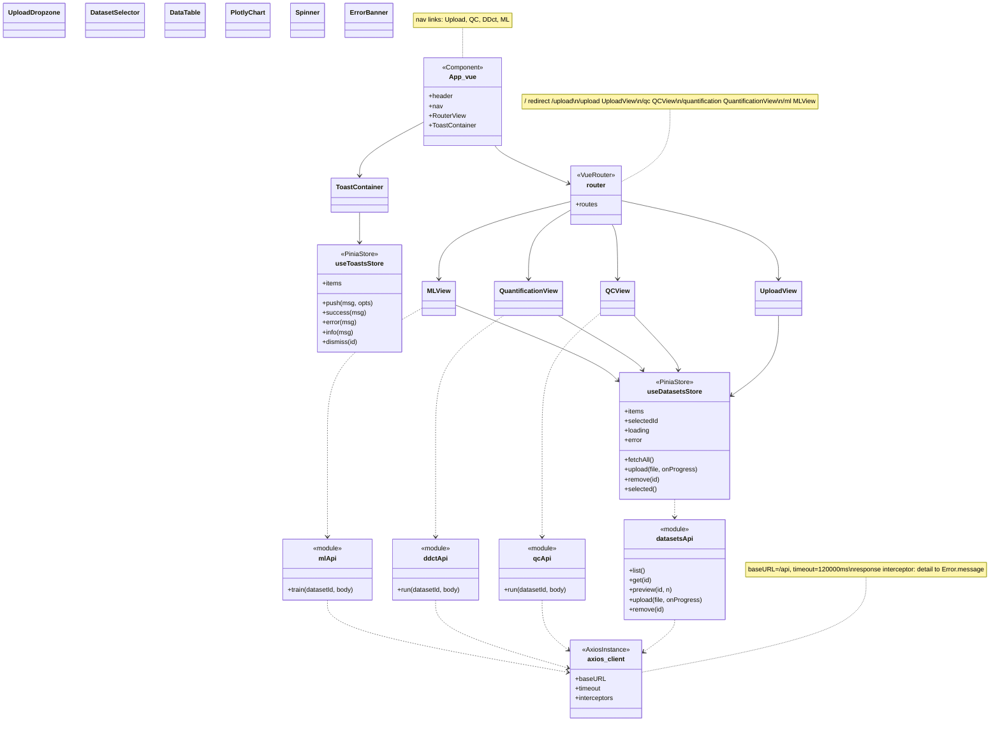
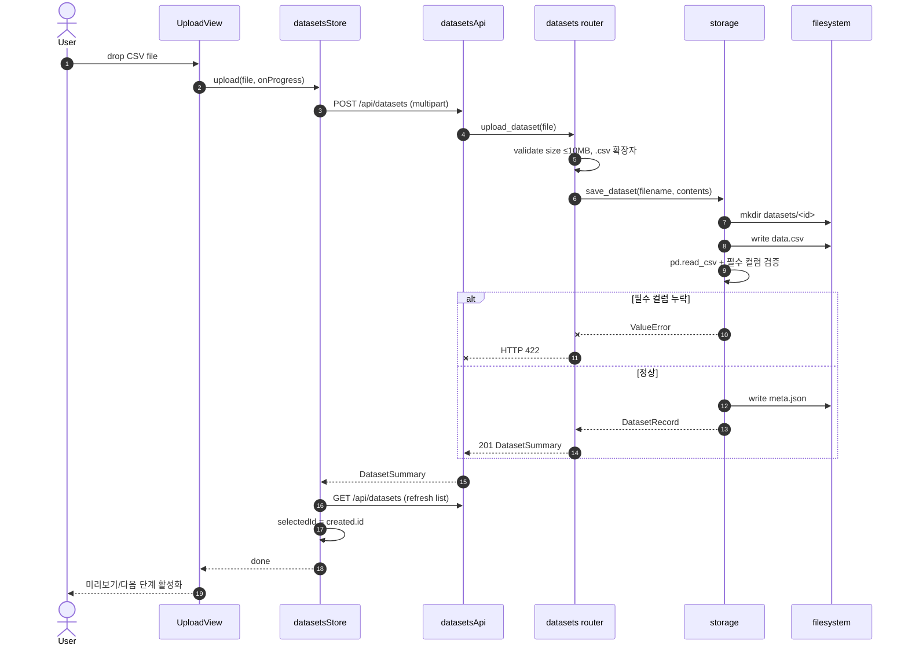
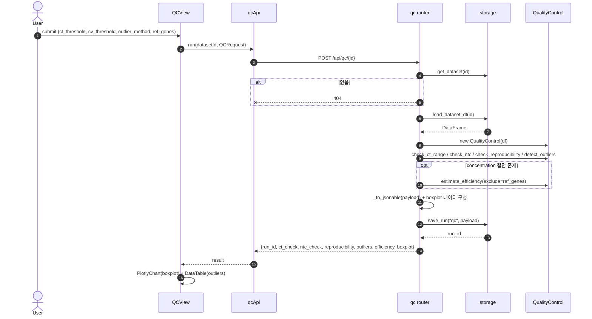
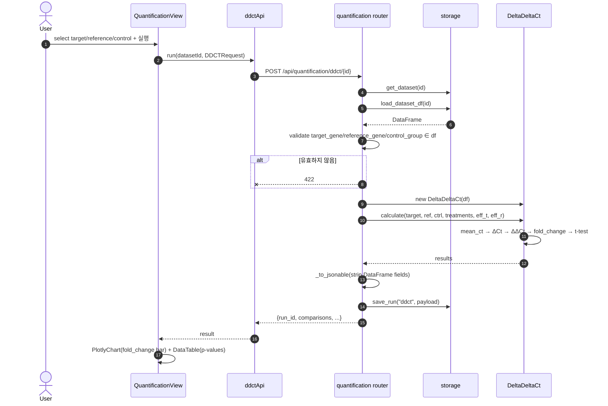
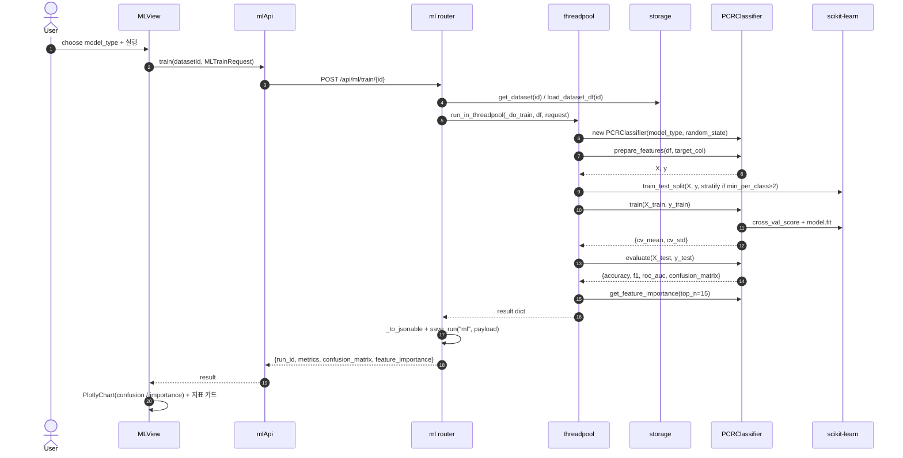
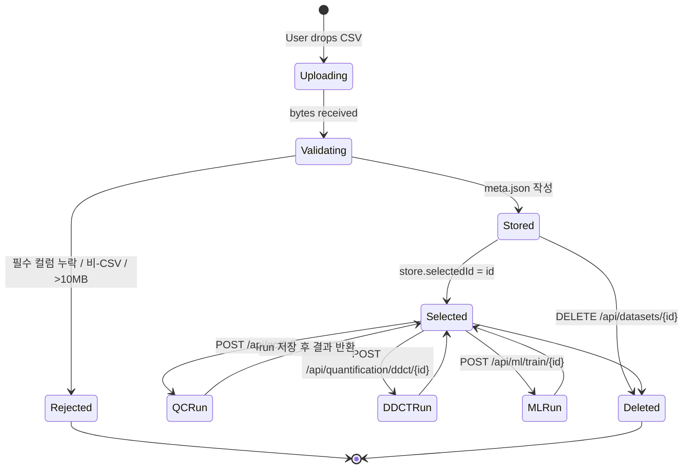

# PCR Diagnostic Project — UML 다이어그램

본 문서는 Mermaid 표기로 작성된 UML 다이어그램 모음이다. GitHub/IntelliJ/VS Code의 Mermaid 프리뷰에서 바로 렌더링된다.

목차
1. 컴포넌트 다이어그램 (시스템 구성)
2. 클래스 다이어그램 — 도메인 계층 (`pcr_diagnostic`)
3. 클래스 다이어그램 — API 계층 (FastAPI + Storage + Schemas)
4. 클래스 다이어그램 — 프론트엔드 (Vue + Pinia + axios)
5. 시퀀스 다이어그램 — 데이터셋 업로드
6. 시퀀스 다이어그램 — QC 분석
7. 시퀀스 다이어그램 — ΔΔCt 정량
8. 시퀀스 다이어그램 — ML 학습
9. 상태 다이어그램 — Dataset 라이프사이클

---

## 1. 컴포넌트 다이어그램

---

## 2. 클래스 다이어그램 — 도메인 계층

`backend/src/pcr_diagnostic/`

---

## 3. 클래스 다이어그램 — API 계층

`backend/api/`

---

## 4. 클래스 다이어그램 — 프론트엔드

`frontend/src/`

---

## 5. 시퀀스 다이어그램 — 데이터셋 업로드

---

## 6. 시퀀스 다이어그램 — QC 분석

---

## 7. 시퀀스 다이어그램 — ΔΔCt 정량

---

## 8. 시퀀스 다이어그램 — ML 학습

---

## 9. 상태 다이어그램 — Dataset 라이프사이클

---

> 참고: 본 다이어그램은 `2026-05-18` 시점의 코드 기준이다. 클래스 시그니처가 갱신되면 함께 업데이트할 것.
